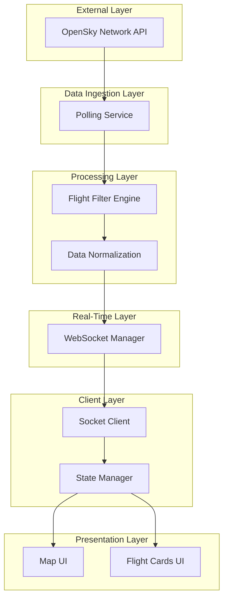
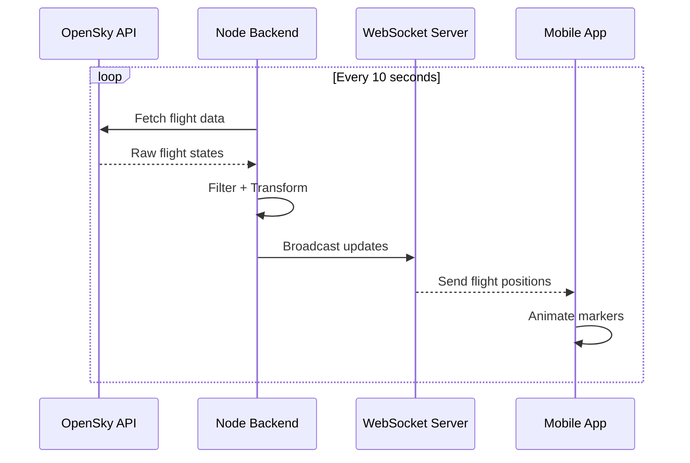

#  Real-Time Flight Tracker

A real-time flight tracking system built with **Node.js (Backend)** and **React Native / Expo (Frontend)**.
This project streams live aircraft data over India and visualizes it with smooth, real-time updates on a mobile map.

The focus of this implementation is not just functionality, but **clean architecture, reliability, and real-time system design thinking**.

---

##  Architecture Overview

The system follows a **backend-driven real-time architecture**:

* Backend pulls and processes flight data
* Backend pushes updates via WebSocket
* Frontend passively consumes and renders updates

This avoids unnecessary client polling and keeps the system efficient.

---

##  System Architecture (Layered View)



---

##  Real-Time Data Flow



---

##  Getting Started

### 1. Backend Setup

```bash
cd flight-tracker/backend
npm install
npm start
```

Runs on:

```
http://localhost:3000
ws://localhost:3000
```

---

### 2. Frontend Setup

```bash
cd mobile
npm install
npx expo start
```

⚠️ Update WebSocket URL in frontend:

```js
ws://YOUR_LOCAL_IP:3000
```

---

##  Key Technical Features

### Backend Flow

1. **Polling**

   * Fetches data every 10 seconds from OpenSky API

2. **Filtering Logic**

   * Airborne only (`on_ground = false`)
   * Velocity > 50 m/s
   * Altitude > 3000m
   * Valid latitude & longitude

3. **Data Transformation**
   Converts raw array → structured JSON:

```json
{
  "id": "icao24",
  "callsign": "IGO573V",
  "position": { "lat": 22.5, "lng": 78.2 },
  "altitude": 9500,
  "speed": 210,
  "vertical_rate": 5,
  "trend": "climbing"
}
```

4. **WebSocket Streaming**

   * Maintains active connections
   * Broadcasts updates every cycle
   * Handles disconnects cleanly

5. **Resilience**

   * Retry with exponential backoff (max 3 attempts)
   * Graceful fallback on failure
   * Defensive null checks

6. **Observability**

   * Logs for:

     * API fetch status
     * filtered flight count
     * active connections

---

### Frontend Flow

1. **WebSocket Lifecycle**

   * Connect on mount
   * Auto reconnect every 3s on failure

2. **Map Rendering**

   * Built using `react-native-maps`
   * Centered over India
   * Displays active flights

3. **Smooth Animation**

   * Interpolates positions instead of jumping
   * Creates “gliding” aircraft movement

4. **UI Layer**

   * Displays:

     * Callsign
     * Altitude
     * Speed
     * Direction (↑ ↓ →)

5. **UX Handling**

   * Loading state
   * Reconnecting state
   * Empty state (no flights)

---

##  Design Decisions

### Why WebSockets?

Polling from client leads to redundant requests.
WebSockets allow **push-based updates**, reducing load and improving real-time experience.

---

### Why Backend Filtering?

Keeps frontend lightweight and ensures:

* consistent data
* no duplicate logic
* centralized validation

---

### Why Limit to 2 Flights?

* Improves clarity for demo
* Avoids UI clutter
* Easily scalable later

---

### Polling Interval (10s)

Balances:

* API rate limits
* real-time perception

---

##  Edge Cases Handled

* OpenSky API downtime
* Empty or insufficient flight data
* WebSocket disconnections
* Invalid/missing coordinates
* No active flights scenario

---

##  Future Improvements

* Redis Pub/Sub for scaling WebSocket layer
* Flight path history (breadcrumb trails)
* Marker clustering for high density
* JWT authentication for secure connections
* Geofencing alerts for flight regions

---

##  What This Project Demonstrates

* Real-time system design fundamentals
* Handling unreliable third-party APIs
* WebSocket-based streaming architecture
* Clean separation of backend and frontend
* Focus on reliability over just “working code”


**Backend-driven • Real-time • Fault-aware • Production-oriented**
